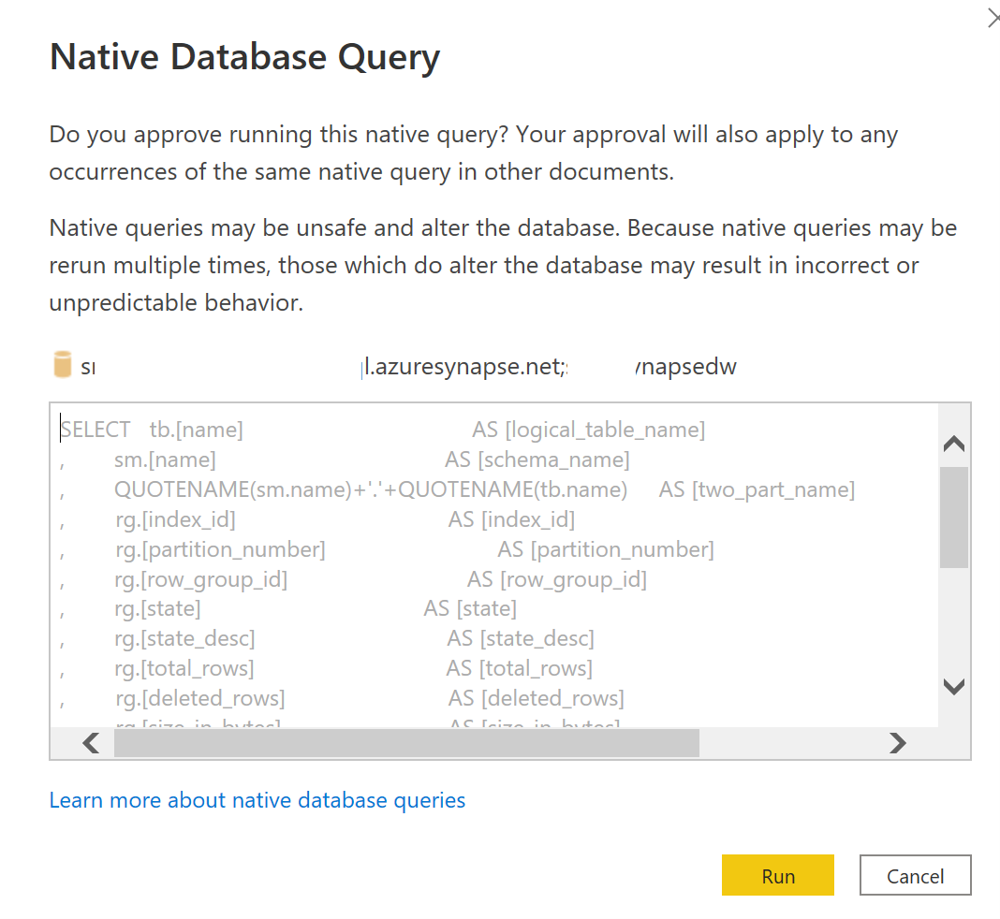

# Using Power BI Template (.pbit) for Synapse Best Practice Report

You can install and use this tool in the following two ways.

1. If you have Power BI Service portal access, with a Power BI Pro license, you can search in the Power BI App marketplace and install it through a Power BI template app.

2. If you do not have access to Power BI service or do not use Power BI then you can download  Power BI template file (*.pbit) from this location. You can then use this pbit file through Power BI desktop (latest build) to install and run report.

Below explains steps to install and run this report using Power BI template file (.pbit) from this location.

## Prerequisite
1. Latest version of Power BI Desktop App from [Microsoft Store](https://aka.ms/pbidesktopstore "Microsoft Store") on your PC.
2. Sysadmin privileges are required to capture information from Synapse dedicated pool. The person setting up refresh, and the credentials used for refresh, should have admin rights on Synapse Dedicated pool and its databases.

## Installation
1. IF not already done, install latest version of Power BI Desktop (Feb-2022 or greater).

2. Open Power BI Desktop on your PC,  
3. It will prompt you for Get Data screen. You can click on Open other reports link

4. Change file type from pbix to pbit (1)
5. Select “Synapse Best Practice Report.pbit” template file provided (2)

6. Click open (3)
7. Dialogue box for Synapse Best Practice report will open

8. Provide Synapse Dedicated Pool Endpoint (1) and Database Name (2) in the parameter text boxes
9. Click Load to open report (3)
10. If you are opening it for the first time it will pop up security warnings. This is because most of the data is collected using native database queries against DMVs. You need to allow each one permission to run by hitting 'Run' on the popup. Like an example below

11. Click “Try Again” to allow it to connect to Synapse Endpoint through Native Query.
12. This should start the refresh process.

13. Once refresh is complete click OK
